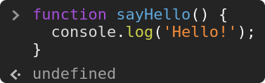
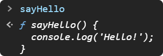
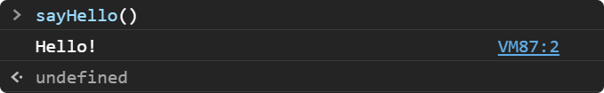

# Type Inference

First of all, let's review something in JavaScript, the [type inference](https://en.wikipedia.org/wiki/Type_inference).

All the "actions" in JavaScript have a return type. It could be, a function, a variable declaration, an assignment, etc...

Take a look at this example:

```javascript
function sayHello() {
  console.log('Hello!');
}
```

We can not see the reserved word `return` inside the function's body, but there is a return type, and when we "don't return anything", the return type is `undefined`.

Let's check this on [DevTools](https://developer.mozilla.org/en-US/docs/Learn/Common_questions/What_are_browser_developer_tools):

<div style="text-align: center">



</div>

As you can see, the function declaration returned `undefined`, but ok. The important detail is now.

Pay attention to these two cases:

### **1. Function implementation**

<div style="text-align: center">



</div>

Observe the return type, it's a function, it happens because the content of `sayHello` is a function. It's similar to use an [arrow function](https://developer.mozilla.org/en-US/docs/Web/JavaScript/Reference/Functions/Arrow_functions) instead, the return will be "the same" (try it later in you browser):

```javascript
() => {
  console.log('Hello!');
};
```

**Keep in your mind**: If I assign to another variable the content of `sayHello`, this variable will also be a function. Something like this:

```javascript
const anotherFunction = sayHello;

// now I am able to call:
anotherFunction();
```

### **2. Function execution**

<div style="text-align: center">



</div>
