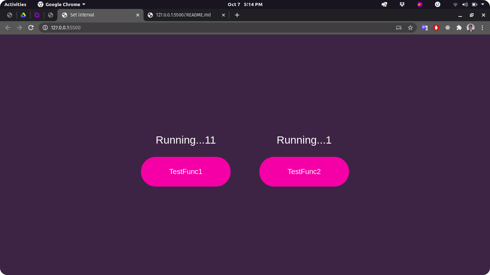

# Return values

First of all, all the "actions" in JavaScript have a return type. It could be, a function declaration, a variable declaration, an assignment, etc...

Take a look at this example:

```javascript
function sayHello() {
  console.log('Hello!');
}
```

We can not see the reserved word `return` inside the function's body, but there is a return type, and when the function "doesn't return anything", the return type is `undefined`.

Let's check this on [DevTools](https://developer.mozilla.org/en-US/docs/Learn/Common_questions/What_are_browser_developer_tools):

<div style="text-align: center">


</div>

As you can see, the function declaration returned `undefined`, but ok. The important detail is now.

Pay attention to these two cases:

### **1. Function implementation**

<div style="text-align: center">


</div>

Observe the return type, it's a function, it happens because the content of `sayHello` is a function. It's similar to use an [arrow function](https://developer.mozilla.org/en-US/docs/Web/JavaScript/Reference/Functions/Arrow_functions) instead, the return will be "the same" (try it later in you browser):

```javascript
() => {
  console.log('Hello!');
};
```

**Keep in your mind**: If I assign to another variable the content of `sayHello`, this variable will also be a function. Something like this:

```javascript
const anotherFunction = sayHello;

// now I am able to call:
anotherFunction();
```

### **2. Function execution**

<div style="text-align: center">


</div>

Let's see the difference from the other case. Now we have an execution, that means we are running each line of the function, in this case, a simple `console.log`.

But pay attention for one detail: `undefined`... What is this and why does it happen?

This is the return of the function... Yes, we don't have the keyword 'return' there, but, as I told before, everything in JavaScript has a return, when we don't specify it, it's undefined.

**Keep in your mind**: Differently of the first case, if we assign the execution of a function who returns `undefined` to a variable, this variable will receive `undefined`:

<div style="text-align: center">


</div>

# Let's go there!

The example given it's based on the API called [`setInterval`](https://developer.mozilla.org/en-US/docs/Web/API/WindowOrWorkerGlobalScope/setInterval). Let's check the structure:

```javascript
setInterval(
  func, // the function to execute between the interval
  delay, // the interval of the function will be executed
  params, // An array of params. They are optional, so let's ignore this for now
);
```

Let's keep our focus on the `func` params. This is the function who will be called, or rather, executed.

Then, it must be the content, not the return of a function, unless your function returns another function, but it's a little bit more confusing, so let's keep our main purpose.

We have two function which do the same thing, with different variables and different elements:

```javascript
function run1() {
  counter1 += 1;
  testdiv1.innerHTML = `Running...${counter1}`;
}
```

The important point here it's the assignment of the intervals, on [onclick event](https://developer.mozilla.org/pt-BR/docs/Web/API/GlobalEventHandlers/onclick) of the buttons:

```javascript
const testFunc1 = () => {
  setInterval(run1, 1000); // it's passed the "content of". What will be execute
};

const testFunc2 = () => {
  setInterval(run2(), 1000); // it's passed the "return value" of the function
};
```

The difference between passing the content or passing the returned value is the use of `()`. When we use the parentheses at the end of a function we are executing this.

In the second variable/function we are assign the result of execution, who is `undefined`, to be executed by intervals of 1000 milliseconds. And that is why only the first button works as expected.

<div style="text-align: center">



</div>

I hope this has helped you with your doubt, but fell free to make a pull request to improve the content or to make another topic on this repo. And issues are also allowed here 😉.

If it could be useful for you, consider give an star for the repo, bye!
